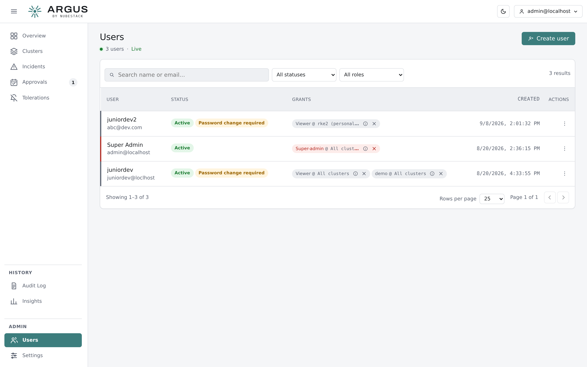

# Users and roles

Every account holds one or more grants. A grant is a role plus the scope it applies to, so
"may approve fixes, in this one cluster" is expressible.

*Each account's grants are listed with the scope each applies to. A grant can be removed
without deleting the account.*

## Creating an account

Create accounts from **Users**. A new account is given an initial password and required to
change it at first sign-in.

Disabling an account keeps its history and its grants but refuses sign-in. Prefer disabling
to deleting for anyone whose past decisions are in the audit trail.

## Grants and scope

A grant answers two questions: what may this person do, and where.

| Scope | Meaning |
|---|---|
| A single cluster | The role applies to that cluster only |
| A cluster group | The role applies to every cluster in that group |
| All clusters | The role applies fleet-wide |

Several grants can be held at once. Someone can be a viewer everywhere and a resolver on
the one cluster their team owns.

## The five built-in roles

| Role | For |
|---|---|
| Super-admin | Full control, plus the two things no other role can do: read the audit log and change organisation-wide settings |
| Tenant-admin | Full operational control, without audit-log access or settings |
| Resolver | Investigating, approving and applying fixes |
| PR approver | Approving fixes that go through a repository, without live-cluster write |
| Viewer | Reading incidents and analyses |

The **Settings → Roles & access** page lists exactly what each role can do, grouped by
area, read live from the hub's own authorisation catalogue.

*What each role can actually do. The list is generated from the hub's authorisation
catalogue rather than maintained by hand, so it cannot drift from what a role is granted.*

## Custom roles

Where none of the five fits, compose a custom role from the same catalogue of capabilities.
Built-in roles have fixed bundles; a custom role is your own bundle.

This is how you express a separation the built-in roles do not: approving a change and
executing one in a live cluster are distinct capabilities, and a role can hold either
without the other.

## Cluster groups

Group clusters so a grant covers a set of them — by environment, by owning team, by region.
A grant scoped to a group follows the group's membership, so adding a cluster to it extends
existing grants rather than needing each one edited.

## Practical advice

Sign in day to day with a named account holding the narrowest role that covers your work,
not with the bootstrap super-admin. Reserve super-admin for the two things it alone can do.

Grant fleet-wide scope sparingly. Most people need one cluster or one group.

## See also

- [Roles and capabilities](../reference/roles.md)
- [Audit log](audit-log.md)
- [First sign-in](../getting-started/first-sign-in.md)
