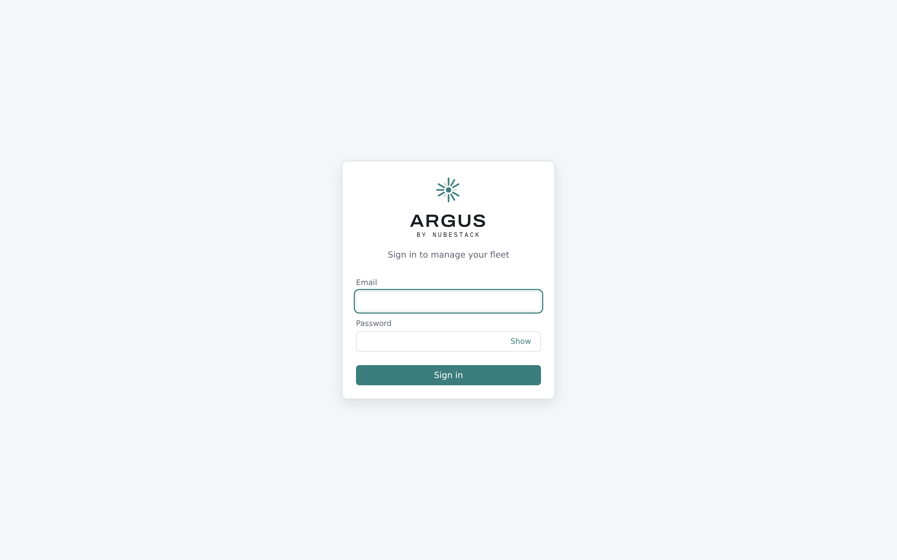

# First sign-in

The hub creates one administrator account at first start. Sign in with it, then change two
things before you connect anything real.

*The sign-in page. Configured single sign-on providers appear as additional buttons above
the password form.*

## Sign in

Open the hub URL. For a Compose evaluation that is `http://localhost:8080`.

| Field | Value |
|---|---|
| Email | `admin@localhost` |
| Password | The bootstrap password from your installation |

For a Compose install the bootstrap password is the one you set in the environment file.
For a Helm install it is generated and stored as a secret in the hub's namespace.

## Change these two things first

**The bootstrap password.** It exists to get you in once. Change it from the account menu
before the hub is reachable by anyone else.

**Your own account.** The bootstrap account is a super-admin with access to every cluster.
Create a named account for yourself with the narrowest role that covers your work, and use
that day to day. See [Users and roles](../administration/users-and-roles.md).

## What you will see

A fresh hub has no clusters and no incidents, so the overview leads with a four-step
onboarding card: create an enrolment token, install the agent, accept the cluster, confirm
the heartbeat. The card tracks the real state of the cluster you are enrolling and
disappears once one is connected.

## See also

- [Configure analysis](configure-analysis.md)
- [Connect a cluster](connect-a-cluster.md)
- [Users and roles](../administration/users-and-roles.md)
